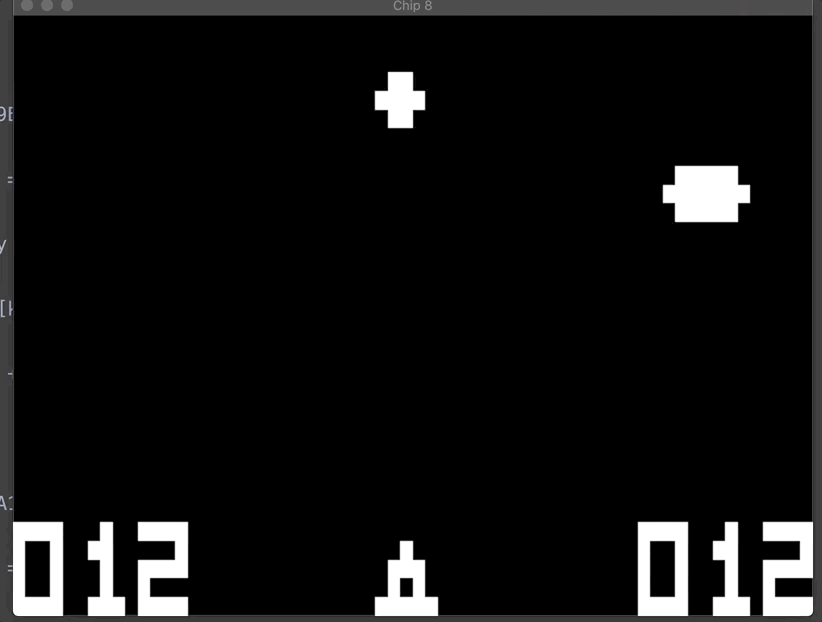
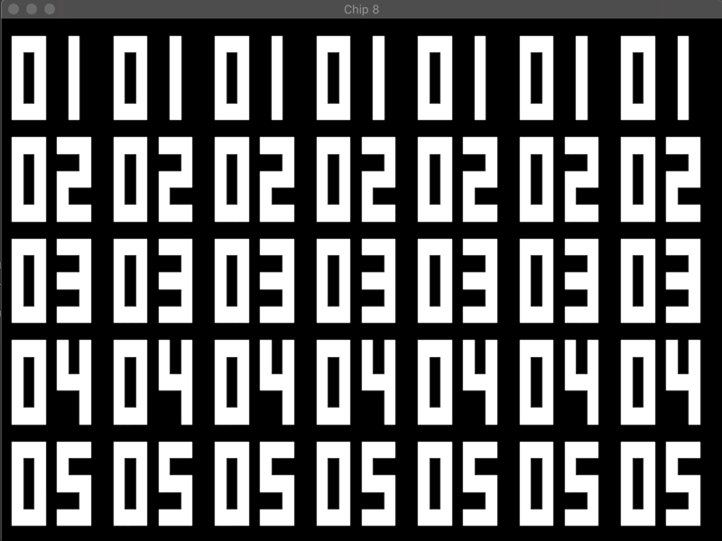

# Chip8

On this project a chip8 emulator will be implemented following a test driven development approach. First, Cowgod (1997) says that "it is a simple interpreted, programming language which was first used on some do-it-yourself computer systems in the late 1970s and early 1980s". In this case, we want to implement the emulator using C++ and SDL for the following reasons:

+ C++ RAII.
+ C++ STL containers (maps and arrays).
+ SDL for managing I/0.

## Dependencies

Before trying to compile the emulator, make sure that you have the SLD library installed.

## How to use

Clone the project:

```bash
git clone https://github.com/rxwp5657/Chip-8.git
```

Create a build directory inside the Chip-8 folder:

``` bash
mkdir ./Chip-8/build
```

Inside the build directory type the following commands for compiling the emulator:

```bash
cmake .. && make
```

And to run the emulator you have to provide a path to the ROM you want to run:

```bash
./chip8 ../resources/ROMS/UFO
```

## Progress
Currently, the emulator can execute some ROMS:



## TODO list
+ Fix input bug which causes odd artifacts when rendering.
+ Implement a simple debugger.